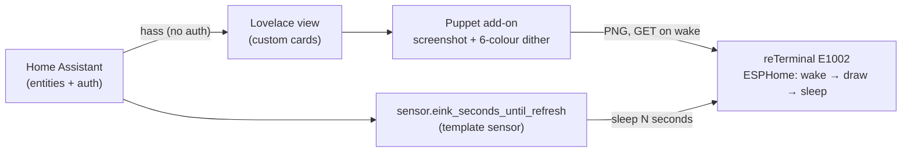

# e-ink dashboard

Custom Home Assistant dashboard cards + device config for a **Seeed reTerminal
E1002** (7.3″ Spectra 6 colour e-paper, 800×480, ESP32-S3), refreshed only at
the times of day you choose to maximise battery life.

The visual design is modelled on [cromelex's e1002 dashboard](https://github.com/cromelex/e1002-esphome-dashboard)
and [this community build](https://community.home-assistant.io/t/an-epaper-wall-dashboard-that-blends-in/950472).

## How it works (architecture)

A Home Assistant **Lovelace view** is screenshotted to a 6-colour image by the
**Puppet** add-on; the device fetches that image on wake, displays it, and
deep-sleeps until the next scheduled time. All data and auth come from Home
Assistant — there is no separate server.



This repo provides three things:

1. **Custom Lovelace cards** (`src/cards/`) — bespoke web components (price,
   weather, calendar, conditions, and a `panel` card that lays them out), tuned
   for the 6-ink e-paper. Installed via **HACS as a Lovelace/Dashboard plugin**.
2. **Home Assistant config** (`ha/`) — the `seconds-until-wake` template sensor
   and time-of-day automations. Copied into your HA config.
3. **Device config** (`device/`) — ESPHome for the reTerminal: deep-sleep that
   reads the template sensor to wake at exactly your chosen times.

The `panel` card composes its slots via Home Assistant's card helpers, so you can
freely mix bundled custom cards with community ones. The shipped dashboard uses:

- **weather** — [`clock-weather-card`](https://github.com/pkissling/clock-weather-card)
  styled to the monochrome e-ink look with [`card-mod`](https://github.com/thomasloven/lovelace-card-mod)
  (line icons recoloured black, white range-bar tracks with solid grey fill, both bordered)
- **price** — the bundled `eink-price-card` (no community equivalent does the öre
  thresholds + 15-min bars)
- **calendar** — [`calendar-card-pro`](https://github.com/alexpfau/calendar-card-pro)

Bundled alternatives (`eink-weather-card`, `eink-calendar-card`, `eink-conditions-card`)
remain available and are fully previewable in the dev harness.

## Display colours (Spectra 6)

The panel can only show **six inks**. Solid card colours must use these exact hex
values so each maps 1:1 to an ink and renders crisp — anything else dithers to a
halftone of the nearest inks (sometimes wanted: the weather bars/icons use grey to
dither black/white, and the mid price bars use `#ff8000` for a deliberate
yellow/red "orange").

| Ink | Use this hex (cards + Puppet `colors=`) | Real on-panel appearance\* |
|-----|------------------------------------------|-----------------------------|
| Black  | `#000000` | `#191E21` |
| White  | `#ffffff` | `#E8E8E8` |
| Red    | `#ff0000` | `#B21318` |
| Green  | `#00ff00` | `#125F20` |
| Blue   | `#0000ff` | `#2157BA` |
| Yellow | `#ffff00` | `#EFDE44` |

\* the real measured inks (Seeed's `7.3in-spectra-e6` profile). We feed the *pure*
hex to the cards and Puppet so deliberate greys/oranges dither cleanly against a
wide palette rather than collapsing into the muted real inks (see
`src/shared/palette.ts` and the note in [SETUP.md](SETUP.md#4-install--configure-the-puppet-add-on)).

## Refresh schedule

Wakes only at **05:30 / 15:30 / 19:00** (edit in `ha/seconds-until-wake.yaml`).
The schedule lives entirely in Home Assistant — the device just reads
`sensor.eink_seconds_until_refresh` and sleeps that long, so changing times never
needs a reflash. ~3 wakes/day ⇒ multi-month battery.

## Repo layout

```
hacs.json                 HACS plugin metadata (points at the built card bundle)
package.json              build (TypeScript + Lit + esbuild)
src/
  index.ts                registers all cards
  cards/                  one web component per custom card
    price-chart-card.ts   6-ink electricity-price bars (first card)
  shared/                 palette tokens + hass helpers
dev/                      standalone browser harness (mock/real hass) for fast iteration
dist/                     built bundle HACS serves (eink-dashboard-cards.js)
dashboards/               reference Lovelace YAML wiring the cards together
ha/                       seconds-until-wake template sensor + automations
device/                   ESPHome config for the reTerminal E1002
```

## Develop a card

Cards are **TypeScript + [Lit](https://lit.dev)** (the framework HA's own frontend
uses), bundled with **esbuild**. HA passes each card a `hass` object with every
entity state — so a card just reads `hass.states['sensor.greenely_prices']`; no
auth, no REST, no data layer.

```bash
npm install
npm run snapshot   # (optional) dump your real HA states to dev/hass-snapshot.json
npm run dev        # serve the harness; iterate the card's HTML/CSS in a browser
npm run build      # produce dist/eink-dashboard-cards.js for HACS
npm run typecheck
```

The harness renders a card at the panel's 800×480 against a mock `hass` (or your
snapshot), so you design against the real screenshot size and real data before
ever loading it into Home Assistant.

## Install (in Home Assistant)

**→ Follow the full step-by-step guide in [SETUP.md](SETUP.md).** It covers the
whole path with the gotchas baked in. In short:

1. **Cards (HACS):** add this repo (category Dashboard) + `clock-weather-card`,
   `card-mod`, `calendar-card-pro`.
2. **Dashboard:** create an `E-ink` dashboard and paste `dashboards/reterminal.yaml`.
3. **Wake-time sensor:** add `ha/seconds-until-wake.yaml` to your config; restart.
4. **Puppet add-on:** install `balloob/home-assistant-addons` → Puppet; give it a
   **dedicated HA user's** token (it persists its theme to that user); start it.
5. **Device:** flash `device/reterminal-e1002.yaml` with ESPHome, pointing
   `image_url` at Puppet (use your HA IP, not `.local`).

## Status

Cards built and previewable in the dev harness against real HA data:

- `eink-price-card` — electricity price bars (öre, today + tomorrow)
- `eink-calendar-card` — day-grouped agenda, colour-coded by calendar
- `eink-conditions-card` — compact sensor strip (indoor/outdoor temp, CO₂)
- `eink-weather-card` — current conditions + forecast range bars (alternative to
  clock-weather-card)
- `eink-panel-card` — composes the slots into the fixed 800×480 layout (the
  single card the Lovelace view uses)

Installed via HACS and verified rendering on a live Home Assistant instance
(the `E-ink` dashboard → `Panel` view). Still to do: install the **Puppet**
add-on and point it at the dashboard, flash the device, and test on hardware;
optional time-of-day dashboard variants (additional tabs in the same dashboard).
