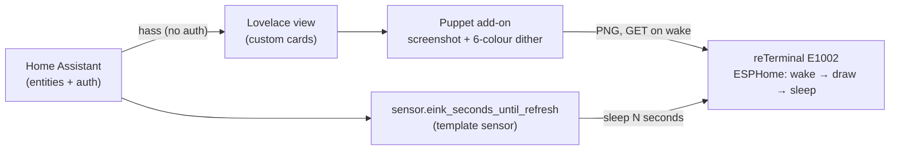

# e-ink dashboard

Custom Home Assistant dashboard cards + device config for a **Seeed reTerminal
E1002** (7.3″ Spectra 6 colour e-paper, 800×480, ESP32-S3), refreshed only at
the times of day you choose to maximise battery life.

The visual design is modelled on [cromelex's e1002 dashboard](https://github.com/cromelex/e1002-esphome-dashboard)
and [this community build](https://community.home-assistant.io/t/an-epaper-wall-dashboard-that-blends-in/950472).

## How it works (architecture)

A Home Assistant **Lovelace view** is screenshotted to a 6-colour image by the
**Puppet** add-on; the device fetches that image on wake, displays it, and
deep-sleeps until the next scheduled time. All data and auth come from Home
Assistant — there is no separate server.



This repo provides three things:

1. **Custom Lovelace cards** (`src/cards/`) — bespoke HTML/CSS web components for
   the whole panel (weather, calendar, electricity price), tuned for the 6-ink
   e-paper. Installed via **HACS as a Lovelace/Dashboard plugin**.
2. **Home Assistant config** (`ha/`) — the `seconds-until-wake` template sensor
   and time-of-day automations. Copied into your HA config.
3. **Device config** (`device/`) — ESPHome for the reTerminal: deep-sleep that
   reads the template sensor to wake at exactly your chosen times.

The panel is built entirely from custom cards so the styling is fully under your
control and previewable in the dev harness. Community cards
([`clock-weather-card`](https://github.com/pkissling/clock-weather-card),
[`calendar-card-pro`](https://github.com/alexpfau/calendar-card-pro)) remain
drop-in alternatives if you'd rather not maintain a custom weather/calendar card.

## Refresh schedule

Wakes only at **05:30 / 15:30 / 19:00** (edit in `ha/seconds-until-wake.yaml`).
The schedule lives entirely in Home Assistant — the device just reads
`sensor.eink_seconds_until_refresh` and sleeps that long, so changing times never
needs a reflash. ~3 wakes/day ⇒ multi-month battery.

## Repo layout

```
hacs.json                 HACS plugin metadata (points at the built card bundle)
package.json              build (TypeScript + Lit + esbuild)
src/
  index.ts                registers all cards
  cards/                  one web component per custom card
    price-chart-card.ts   6-ink electricity-price bars (first card)
  shared/                 palette tokens + hass helpers
dev/                      standalone browser harness (mock/real hass) for fast iteration
dist/                     built bundle HACS serves (eink-dashboard-cards.js)
dashboards/               reference Lovelace YAML wiring the cards together
ha/                       seconds-until-wake template sensor + automations
device/                   ESPHome config for the reTerminal E1002
```

## Develop a card

Cards are **TypeScript + [Lit](https://lit.dev)** (the framework HA's own frontend
uses), bundled with **esbuild**. HA passes each card a `hass` object with every
entity state — so a card just reads `hass.states['sensor.greenely_prices']`; no
auth, no REST, no data layer.

```bash
npm install
npm run snapshot   # (optional) dump your real HA states to dev/hass-snapshot.json
npm run dev        # serve the harness; iterate the card's HTML/CSS in a browser
npm run build      # produce dist/eink-dashboard-cards.js for HACS
npm run typecheck
```

The harness renders a card at the panel's 800×480 against a mock `hass` (or your
snapshot), so you design against the real screenshot size and real data before
ever loading it into Home Assistant.

## Install (in Home Assistant)

1. **HACS → Custom repositories** → add this repo, category **Dashboard** →
   install. HACS serves the card JS and registers the Lovelace resource.
2. Install community cards (`clock-weather-card`, `calendar-card-pro`,
   `apexcharts-card`) and the **Puppet** add-on.
3. Build your view from `dashboards/` (uses `type: custom:eink-price-card` etc.).
4. Copy `ha/seconds-until-wake.yaml` + `ha/automations.yaml` into HA config; restart.
5. Flash `device/reterminal-e1002.yaml` with ESPHome; point it at Puppet's image
   URL for your view.

## Status

Cards built and previewable in the dev harness against real HA data:

- `eink-price-card` — electricity price bars (öre, today + tomorrow)
- `eink-weather-card` — current conditions + daily forecast range bars
- `eink-calendar-card` — day-grouped agenda, colour-coded by calendar
- `eink-panel-card` — composes the three into the fixed 800×480 layout (the
  single card the Lovelace view uses)

Plus `dashboards/reterminal.yaml` (the composed Lovelace view), and the
supporting config in `ha/` (template sensor + automations) and `device/`
(ESPHome). Still to do: install in HA via HACS, wire the Puppet add-on, and test
on hardware; optional time-of-day dashboard variants.
